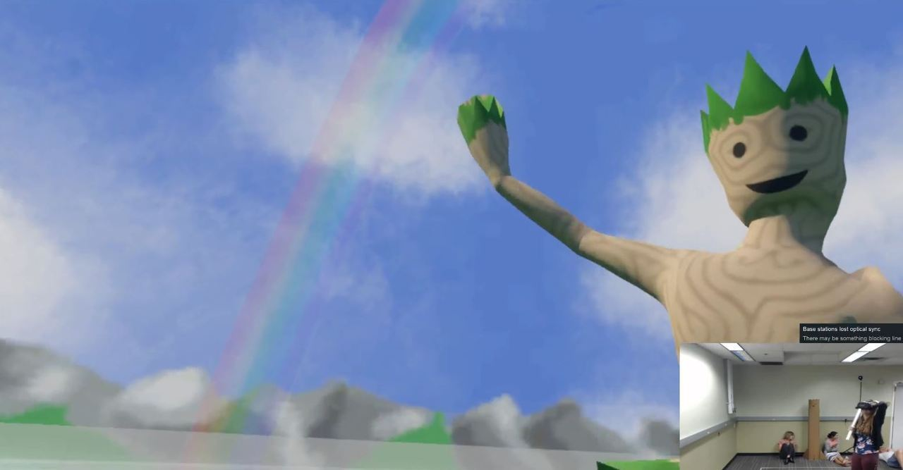
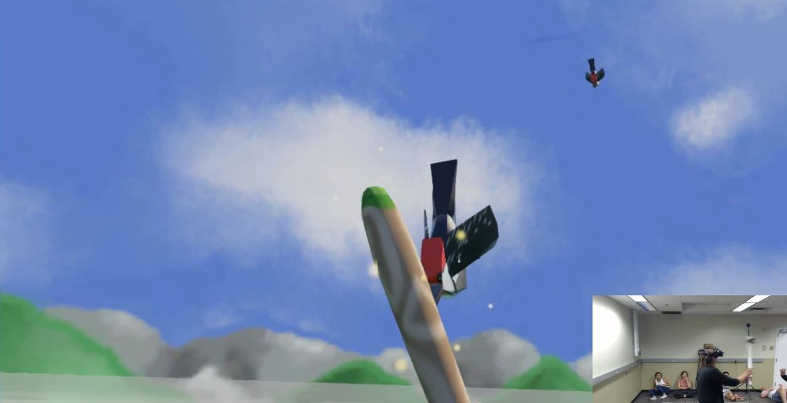

**Entertainment Technology Center (ETC), Carnegie Mellon University
Building Virtual Worlds (BVW), 2018**

**Platforms:** Vive VR, Vive trackers, Unity, C#  
**Scope:** Built in two weeks with team of five  
**My role:** Programmer

“Me & My Yodeling Treeman”  
A VR experience where the guests plants a tree then protect it from vicious woodpeckers annoyed by the tree's enthusiastic yodeling. 

What I did:
* Design the experience with the team
* Calibrate virtual bat with Vive tracker
* Maintain state machine code as needed
* Various animations and events
* Place and integrate art assets

Particularly proud of:
* This was made in my second and third week developing with Unity and first time working with VR, I feel I still managed to make myself useful
* Animating a rainbow fading in at the end
* Doing some experience testing of a core mechanic - knocking blocks in VR with a bat 
* An effective cutscene transition with post processing

My collaborators were all wonderful: